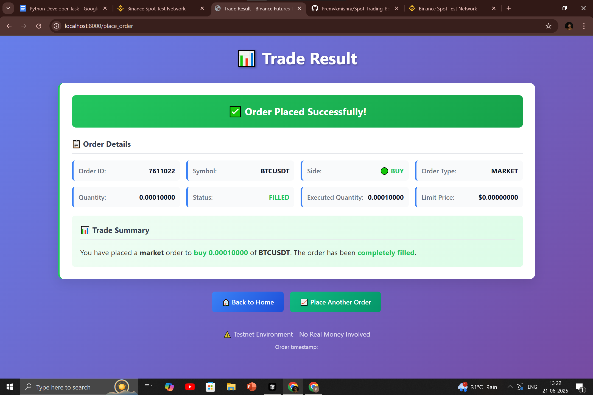
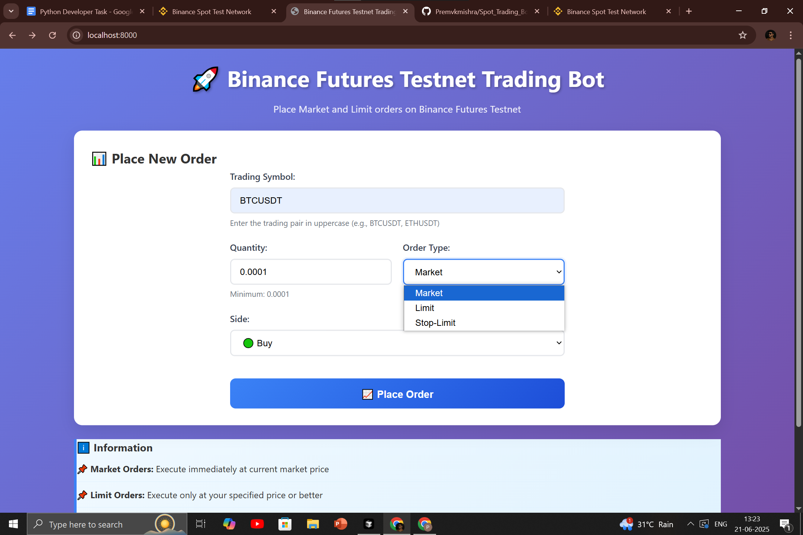
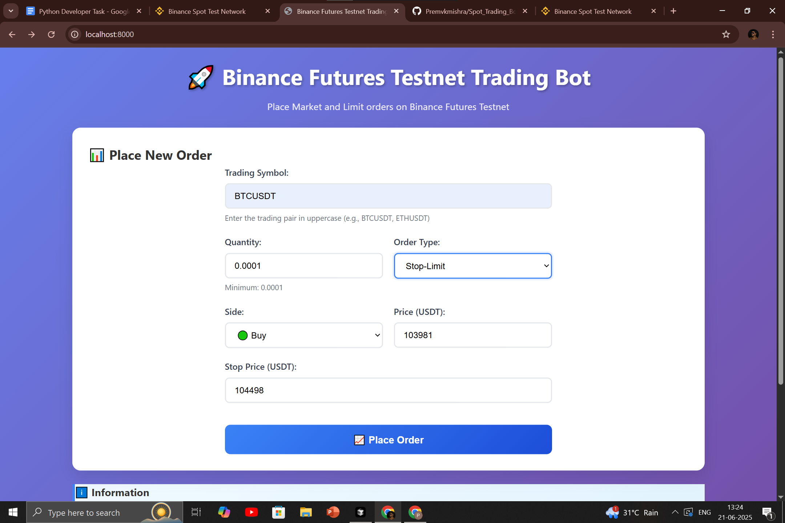
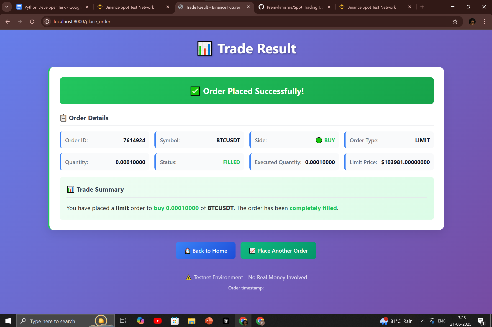
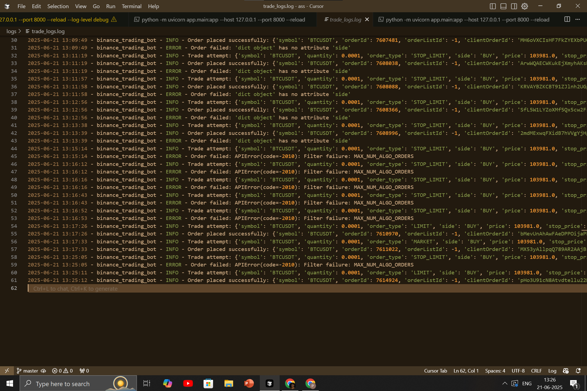

# 🚀 Binance Spot Testnet Trading Bot

A modern web-based trading interface for placing Market, Limit, and Stop-Limit orders on the Binance Spot Testnet. Built with FastAPI, HTML/CSS, and the python-binance library.


## 📸 Screenshots

<p align="center">
  
  
  
  
  
</p>

## ✨ Features

- 📊 **Interactive Trading Interface**: Clean, responsive web interface for placing orders
- 🔄 **Three Order Types**: Support for Market, Limit, and Stop-Limit orders
- 🛡️ **Input Validation**: Comprehensive client and server-side validation
- 📝 **Detailed Logging**: All trades and errors logged with timestamps
- 🎯 **Real-time Results**: Immediate feedback on order execution
- 📱 **Mobile Responsive**: Works seamlessly on desktop and mobile devices
- ⚠️ **Testnet Safe**: Uses Binance Spot Testnet - no real money involved
- 🔐 **Secure API Integration**: Proper authentication and error handling
- ⏰ **Time Synchronization**: Automatic time sync with Binance servers
- 🚀 **Easy Deployment**: Ready for Railway, Render, and Heroku deployment

## 🏗️ Project Structure

```
binance_trading_app/
│
├── app/
│   ├── templates/
│   │   ├── index.html        # Home page with trade form
│   │   └── result.html       # Trade result page
│   ├── static/
│   │   └── style.css         # CSS styling
│   ├── main.py               # FastAPI application
│   ├── binance_client.py     # Binance API interaction
│   └── logger.py             # Logging configuration
│
├── .env                      # Environment variables (create from .env.example)
├── requirements.txt          # Python dependencies
├── Procfile                  # Railway deployment configuration
├── render.yaml               # Render deployment configuration
├── start.sh                  # Startup script
└── README.md                 # This file
```

## 🚀 Quick Start

### Prerequisites

- Python 3.8+
- Binance Spot Testnet account and API keys

### 1. Get Binance Testnet API Keys

1. Visit [Binance Spot Testnet](https://testnet.binance.vision/)
2. Create an account or log in
3. Generate API Key and Secret
4. **Important**: Keep your API credentials secure and never share them

### 2. Local Development Setup

```bash
# Clone the repository
git clone <your-repo-url>
cd binance_trading_app

# Create virtual environment
python -m venv venv

# Activate virtual environment
# Windows:
venv\Scripts\activate
# macOS/Linux:
source venv/bin/activate

# Install dependencies
pip install -r requirements.txt

# Create environment file
cp .env.example .env

# Edit .env file with your API credentials
# API_KEY=your_binance_testnet_api_key
# API_SECRET=your_binance_testnet_secret

# Run the application
uvicorn app.main:app --reload
```

Visit `http://localhost:8000` to access the trading interface.

### 3. Railway Deployment

#### Step 1: Prepare for Deployment

1. Create a Railway account at [railway.app](https://railway.app)
2. Install Railway CLI:
   ```bash
   npm install -g @railway/cli
   ```
3. Login to Railway:
   ```bash
   railway login
   ```

#### Step 2: Deploy

1. Initialize Railway project:
   ```bash
   railway init
   ```

2. Set environment variables:
   ```bash
   railway variables set API_KEY=your_binance_testnet_api_key
   railway variables set API_SECRET=your_binance_testnet_secret
   ```

3. Deploy the application:
   ```bash
   railway up
   ```

4. Your app will be available at the provided Railway URL.

## 📖 Usage Guide

### Placing Orders

1. **Navigate to the trading interface**
2. **Fill out the order form**:
   - **Symbol**: Enter trading pair (e.g., `BTCUSDT`, `ETHUSDT`)
   - **Quantity**: Enter order quantity (minimum 0.0001)
   - **Order Type**: Select Market, Limit, or Stop-Limit
   - **Side**: Choose Buy or Sell
   - **Price**: Required for limit and stop-limit orders
   - **Stop Price**: Required for stop-limit orders only

3. **Submit the order**
4. **View results** on the result page

### Order Types

- **Market Orders**: Execute immediately at current market price
- **Limit Orders**: Execute only at specified price or better
- **Stop-Limit Orders**: Trigger when stop price is reached, then execute as limit order

### Supported Symbols

All Binance Spot symbols are supported. Popular examples:
- `BTCUSDT` - Bitcoin/USDT
- `ETHUSDT` - Ethereum/USDT
- `ADAUSDT` - Cardano/USDT
- `DOTUSDT` - Polkadot/USDT

## 🔧 Configuration

### Environment Variables

| Variable | Description | Required |
|----------|-------------|----------|
| `API_KEY` | Binance Spot Testnet API Key | Yes |
| `API_SECRET` | Binance Spot Testnet Secret Key | Yes |

### Logging

All trades and errors are logged to `logs/trade_logs.log` with the following information:
- Timestamp
- Trade parameters
- API responses
- Error details

## 🛡️ Security Notes

- **Testnet Only**: This application is designed for Binance Spot Testnet
- **API Keys**: Never commit API keys to version control
- **Environment Variables**: Use `.env` file locally and environment variables in production
- **No Real Money**: Testnet uses fake money for testing purposes

## 🔍 API Endpoints

### `GET /`
- **Description**: Renders the home page with trading form
- **Response**: HTML page

### `POST /place_order`
- **Description**: Processes trade form and places order
- **Parameters**:
  - `symbol` (string): Trading pair
  - `quantity` (float): Order quantity
  - `order_type` (string): "MARKET", "LIMIT", or "STOP_LIMIT"
  - `side` (string): "BUY" or "SELL"
  - `price` (float, optional): Price for limit and stop-limit orders
  - `stop_price` (float, optional): Stop price for stop-limit orders
- **Response**: HTML page with results

## 🐛 Troubleshooting

### Common Issues

1. **"Invalid symbol" error**
   - Ensure symbol is uppercase (e.g., `BTCUSDT`)
   - Check if symbol exists on Binance Spot

2. **"Insufficient balance" error**
   - Your testnet account needs balance
   - Visit [Binance Spot Testnet](https://testnet.binance.vision/) to get test funds

3. **"Filter failure: PERCENT_PRICE_BY_SIDE" error**
   - Use realistic prices close to current market price
   - For BTCUSDT, use prices around $100,000+ (not $0.02)

4. **"MAX_NUM_ALGO_ORDERS" error**
   - You have too many pending stop-limit orders
   - Cancel some existing orders or use market/limit orders instead

5. **"Stop price would trigger immediately" error**
   - For STOP_LIMIT BUY: stop price must be ABOVE current market price
   - For STOP_LIMIT SELL: stop price must be BELOW current market price

## 🚀 Deployment Options

### Railway
- Automatic deployment from GitHub
- Easy environment variable management
- Free tier available

### Render
- Use the provided `render.yaml` file
- Automatic deployment configuration
- Free tier available

### Heroku
- Traditional deployment option
- Use the provided `Procfile`
- Free tier available

## 📈 Future Enhancements

- [ ] Real-time price charts
- [ ] Order history tracking
- [ ] Portfolio management
- [ ] Advanced order types (OCO, Trailing Stop)
- [ ] WebSocket price updates
- [ ] Multiple exchange support

## 🤝 Contributing

1. Fork the repository
2. Create a feature branch
3. Make your changes
4. Add tests if applicable
5. Submit a pull request

## 📄 License

This project is licensed under the MIT License - see the [LICENSE](LICENSE) file for details.

## ⚠️ Disclaimer

This software is for educational purposes only. It uses Binance Testnet and does not involve real money. Always test thoroughly before using with real funds. The authors are not responsible for any financial losses.

---

**Made with ❤️ for the crypto community**